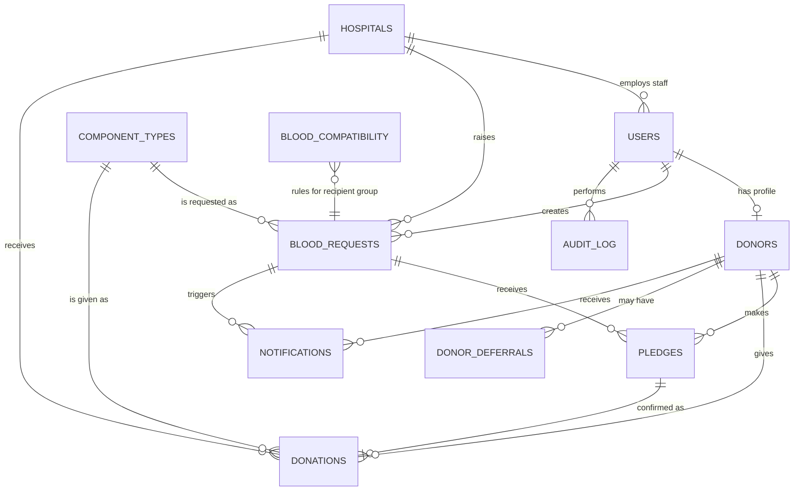

# Entity-relationship diagram

```mermaid
erDiagram
    HOSPITALS ||--o{ USERS : "employs staff"
    USERS ||--o| DONORS : "has profile"
    HOSPITALS ||--o{ BLOOD_REQUESTS : raises
    USERS ||--o{ BLOOD_REQUESTS : creates
    COMPONENT_TYPES ||--o{ BLOOD_REQUESTS : "is requested as"
    BLOOD_REQUESTS ||--o{ PLEDGES : receives
    DONORS ||--o{ PLEDGES : makes
    PLEDGES ||--o| DONATIONS : "confirmed as"
    DONORS ||--o{ DONATIONS : gives
    HOSPITALS ||--o{ DONATIONS : receives
    COMPONENT_TYPES ||--o{ DONATIONS : "is given as"
    DONORS ||--o{ DONOR_DEFERRALS : "may have"
    BLOOD_REQUESTS ||--o{ NOTIFICATIONS : triggers
    DONORS ||--o{ NOTIFICATIONS : receives
    USERS ||--o{ AUDIT_LOG : performs
    BLOOD_COMPATIBILITY }o--|| BLOOD_REQUESTS : "rules for recipient group"
```

`BLOOD_COMPATIBILITY` is a rules table joined by blood group value rather than by foreign key.
